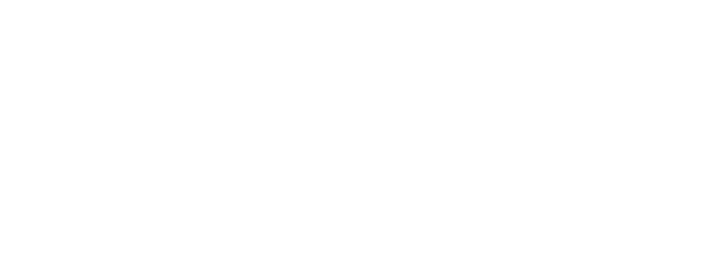

---

A multi-platform framework for games and applications, primarily for research and experience.

GenV (or General ENgine for V(5th gen), Generation 5) is a game engine system designed for those who want to develop for various consoles and computers but want to get an easy way in to start with. There's been several SDKs and engines for various platforms but they all tend to be specific, such as PsyqO in the PS1 case where it is a very good SDK but only for making PS1 games. GenV then follows a theory that you don't have to know any of the specifics of the consoles or PCs so you can code up an app with no care as to how the platform is. But it can have more specific bits of code for such (i.e. Arcade systems needing coin-up code).

## Project Status
> **This whole repo is currently in a pre-alpha state, it is not ready for general use!**

Currently the engine is in active development and the core API is subject to change without notice. Many major systems are in a skeleton or pre-alpha state, notably:
* 3D Rendering is planned but not yet implemented.
* Animations of 2D and 3D actors is planned but not yet implemented.
* Audio is in a premilinary state on some platforms and completely unimplemented on others.
* Input controls are in a preliminary state
* FFB/General output support is planned but not yet implemented.

If you would like to contribute, please see [Contributing](#contributing).

### Supported platforms:
<table><thead>
  <tr>
    <th>Category</th>
    <th>Platform</th>
  </tr></thead>
<tbody>
  <tr>
    <td>Computers</td>
    <td>
	 
	 
	 
	</td>
  </tr>
  <tr>
    <td>Consoles</td>
    <td> 
	 
	</td>
  </tr>
  <tr>
    <td>Arcade</td>
    <td> 
	 
	</td>
  </tr>
</tbody>
</table>

More platforms can be supported with a dedicated abstraction layer, however plaforms not in this list are not currently planned to be added.

## Contributing

Pull requests are welcome. If you wish to add functionality feel free to do so,
however please stick to the following guidelines:

- Do not include any code lifted as-is or minimally modified from a game disassembly. Rewritten and properly explained/commented code is fine.
- Adding a section to the documentation covering usage of the newly added functionality is not required, but would be highly appreciated.
- If you are adding a new system, please make sure you include a TODO list if features are not yet implemented so that maintainers can keep a track of platform support.

If you have any questions or doubts, or want to propose new features, feel free
to reach out to the authors by opening an issue or through one of the Discord
servers linked at the end of the page.

## License
[Marco Paland's printf library](https://github.com/mpaland/printf), [spicyjpeg's ps1-bare-metal](https://github.com/spicyjpeg/ps1-bare-metal) and parts of [spicjpeg's 573in1](https://github.com/spicyjpeg/573in1) used in this repository is licensed under the MIT license. The only "hard" requirements are attribution and preserving the license notice; you may otherwise freely use any of the code for both non-commercial and commercial purposes (such as a paid homebrew game or a book or course).

GenV as a whole is licensed under the GPL V3.0 license.  

1. Anyone can copy, modify and distribute this software.
2. You have to include the license and copyright notice with each and every distribution.
3. You can use this software privately.
4. You can use this software for commercial purposes.
5. If you build your business solely from this code, you risk open-sourcing the whole code base.
6. If you modify it, you have to indicate changes made to the code.
7. Any modifications of this code base MUST be distributed with the same license, GPLv3.
8. This software is provided without warranty.
9. The software author or license can not be held liable for any damages inflicted by the software.

See the GNU General Public License for more details.

Additionally, whilst not a strict requirement, we do ask that software using GenV show our logo or explain in the application and documentation that GenV is being used and that credit to the authors of GenV is shown in any screens or files where appropriate.

## Acknowledgements
This project has come about from the desire to dive into the world of game development and would not have been possible or come as far as it has with out the following people and articles. We'd like to take a moment to acknowledge their work.
* [The Ultimate DirectX Tutorial by Chris 'dastopher'](http://www.directxtutorial.com/LessonList.aspx?listid=9)
* spicyjpeg - [ps1-bare-metal](https://github.com/spicyjpeg/ps1-bare-metal), [573in1](https://github.com/spicyjpeg/573in1)
* [psx-spx](https://psx-spx.consoledev.net/)
* [PSX.Dev Discord](https://discord.gg/QByKPpH)