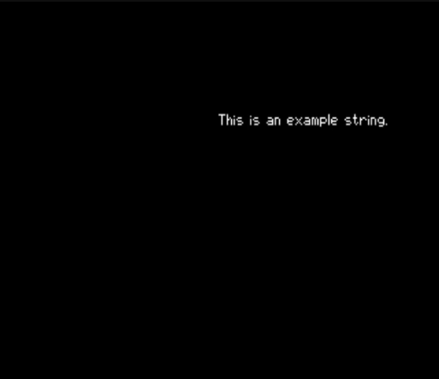

# Dev Blog for NaokiS

### 4th November 2025

Well, a day later and I managed to get some other parts working enough to show the generic error message screen. Why is this notable? Well it was written and coded for Windows! Well... ok. It was coded on Windows and when being coded GenV, or DXUX as it was called then, ran only on Windows. So this is technically the first "Application" that ran almost perfectly the first time I tried to run it, outside of back-end bugs. The only things that needed to be changed were some of the font alignment values since they were hard coded to look good at 800x600 with a different font. This is to say, it would have translated pretty well if I used the font sizing and spacing back then, but now I have to API to do so!

So some points about whats going on here:

This is the generic error screen in GenV. When something goes wrong that requires the user to be aware (think more arcade operations than anything), this fades the background out and highlights the error message to the user. It is also supposed to pause the application that was running (or rather stop updates) but that isn't yet working. You can see the following:

* Title
* Error Severity - The default error screen supports Info, Warning, Error and as you see here, Critical Error.
  * Info screens - This displays a solid blue colour border and serves more to inform the user of an action (IE, machine needs to restart). The fact it's part of the error message class is a bit misleading but it's almost all the same code so there we go.
  * Warning screens - These instead show a flashing yellow border and are for when there is non-critical trouble. An example case might be a stuck control or failure to read a memory device.
  * Error screens/Critical Errors - These are severe errors with a flashing red border that cannot be ignored, i.e. the disc drive is missing the media, a required file cannot load or such. Critical errors differ in that they will halt the program execution until reboot.
* Error cause - Self explanatory really, the caller of the error code function passes a reason to the error screen to display, in this case "Both app pointers are null". In this example, the foregroundApp and backgroundApp Application class pointers are both nulled out and there is nothing to run. This is a critical error because there must always be an application running in order for execution flow to happen normally as loading screens (which GVSS is a special kind of loading screen) are only initiated from the running foregroundApp. So with nothing to run, a critical error occurs.
* Button options - In reality, in the case of a critical error this would be blank as there is no continuing from a critical error, but for testing these were enabled. This field can be customised by the caller to have different buttons and actions, but the error screen does not process these inputs, only handing them to the running app. In the case of an error screen, it could give an operator the chance to try again or go into the test mode of the game.

One fun note is how the text uses the same bitmap graphics and modifies the colour lookup table to use when rendering. On the PS1, each call to render text will check to see if the colour requested has been used before (outside of white), if the colour has not been used then it will create and upload a new colour pallete to use and store that in a table of previous colours, up to 8. I have also been working on a popularity list object that will keep the most frequently used items in memory so if there is no more space in the colour list, it will remove the least used colour.

There are some changes I wish I could make such as having a global colour table that can be used across several objects but... thats a later problem.

Anyway a small update but something more betterer than yesterdays images.

Naoki

---

### 3rd November 2025

This is the first entry in a crude dev blog that I am starting to mostly track changes for myself. Also because I feel some of the things I dont explain well in git commits or comments in code could fall here.

#### What is GenV?

A quick note for those who have stumbled on this repo and want to learn more:
GenV (or General ENgine for V(5th gen), Generation 5) is a game engine system designed for those who want to develop for various consoles and computers but want to get an easy way in to start with. There's been several SDKs and engines for various platforms but they all tend to be specific, such as PsyqO in the PS1 case where it is a very good SDK but only for making PS1 games. GenV then follows a theory that you don't have to know any of the specifics of the consoles or PCs so you can code up an app with no care as to how the platform is. But it can have more specific bits of code for such (i.e. Arcade systems needing coin-up code).

So basically Unity/Unreal... ***kind-of*** but where the minimum common platform is 5th gen platforms, IE PS1. In theory N64 and Saturn could be targets too but I've not written nor intend to make backends for those 😉

#### Updates

Anyways, I pushed a *small* update today mostly to keep the git repo up to date, but now the code base is at least at a very early alpha stage. It can render to the screen! I know, such an amazing achievement. At the moment it will show a crudely drawn GenV logo with a MegaDrive/Geni-sus TMSS style screen (altough it looks more like the Dreamcast TMSS than anything), then load the example app to display "This is an example string.". None of it looks particularly great (well the font does but spicyjpeg did that), but it's trivially fixed. I'm going to update the GenV logo loaded to be a 16-bit image for proper anti-aliasing and render it as a flat quad to do some scaling effects for an intro animation, cuz ya gotta have the fancies.

Other pitfalls I am going to encouter in doing this and making the GenV logo look nice is how to abstract the PS1's specific quirks into an API that tries to not care for quirks of a specific system. Specficically, the PS1's implementation of alpha blending is... interesting. Either a pixel is truly alpha (#0000) or partly transparent (bit 15 set high), then uses either additive, subtractive or quater blend modes. And understanding these modes from purely reading [https://psx-spx.consoledev.net](https://psx-spx.consoledev.net) is difficult. I'm sure a better solution will present itself in due course but my current thinking is to use the 8-bit alpha value stored in most formats and GenV's colour struct to aid in this, picking the best blend mode that it can. Invariably at some point textures would have to be optimised for PS1 rendering which would require specific textures to avoid alpha-bended regions outside of simple shadows.

Anywho as of [commit 8136a1c](https://github.com/NaokiS28/GenV/commit/8136a1c3808ff3dd0f12fcb0c071eda1fc942008), we currently show this:

**A few notes about this image:**

The blue screen is shown on debug builds to visually indicate that the GPU core has started and finished initialisation. On release builds this will render as black to clear the screen instead.

The GenV logo will always be show first, though I'm planning to make it be overwrittable perhaps so it can be customised as part of the programmers start up sequence, but I would like to make it a part of the requirements to show the logo when the engine is used - This is going to be an item I think about in the long run because I dont want it to be a hindrence or detraction, but equally I want to bring attention to the project so it can encourage more game developers to work on classic consoles!

The example app (which is only compiled when no other app is built with GenV, theoretically anyways) will show case the various engine features as they get added and to show how the same apps can run on multiple platforms. There's a long way to go before that but small steps.

#### Next steps

Once I've tidied a few things I'll probably work more on the GenV logo just to make it look nicer even if its still a static image and text, then start working on controller code. After all, I bought a big bunch of controllers and adaptors over the previous months, I need to start actually testing them out or I'm going to have to find another excuse to use when the significant other asks!

I'll see if I can keep a monthly update on this going. Knowing my progress with these kinds of things, probably not, but ah well.

Naoki
