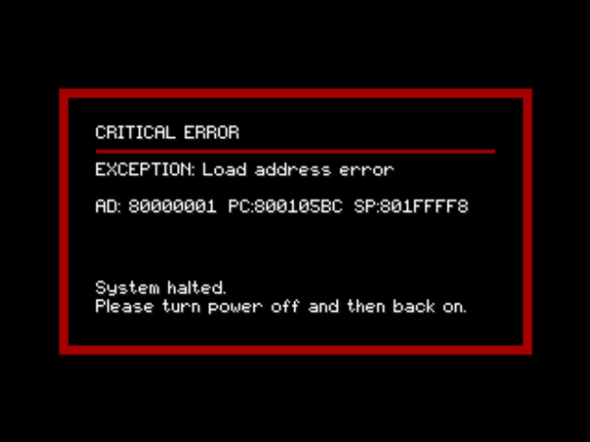
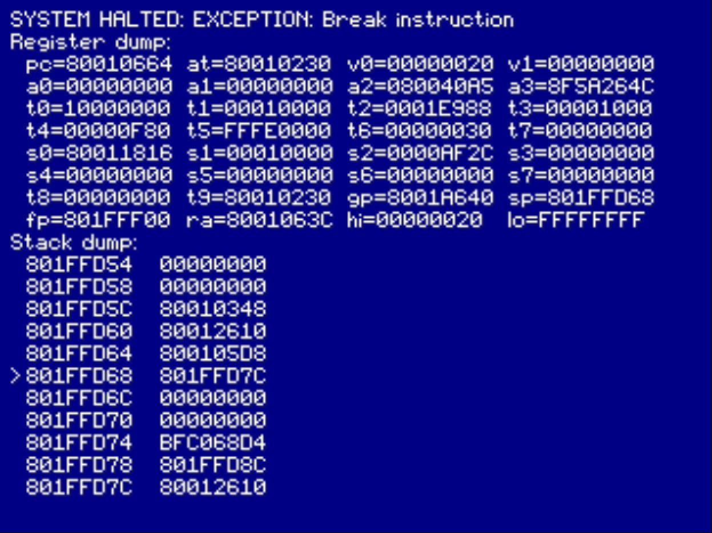

# PlayStation-based Halt Screen

This "driver" is a fallback when an unrecoverable exception occurs. It's sole purpose is to log the crash dump both to the screen and to the SIO1 port. As GenV is considered as being in an invalid state at this point, none of the halt screen relies on GenV's core functions. The whole screen is written in plain C where:

* The GPU is reset into a known state.
* The SIO1 port is reinitialised at 115200 baud, 8N1.
* The system "drivers" are plain C versions compared to the PlayStation common core.

Leafs can register functions to be used during init and display should they need any extra functions performing such as a watchdog kick on arcade based cores.

```c
// Registers a function to be called after the before screen has been
// displayed. Used by platform-specific code (e.g. extra hardware
// required to be initialised prior to the halt screen showing.
void psx_halt_prepend_func(PostHaltFunc func);

// Registers a function to be called after the halt screen has been
// displayed. Used by platform-specific code (e.g. System 573 watchdog
// kick / countdown before reboot).
void psx_halt_append_func(PostHaltFunc func);
```

And to use them, just place them in the platform's System driver:

```c++
 // From Konami System 573 driver
int Sys573System::initVideo()
{
    int error = 0;
    gpu       = new GPU::PSXGPU(GP1_VRAM_1MB);
    error     = ioTest(gpu, PSX_GPU_STR, PSX_CREATE_STR);
    if (!error) ioTest(gpu->init(), PSX_GPU_STR, PSX_INIT_STR);
    if (!error) services.setVideo(adminKey, gpu);
    psx_halt_append_func(sys573_halt_delay); // Added here - the watchdog will now be kicked.
    tickWatchdog();
    return error;
}
```

If an unrecoverable error occurs, now the halt screen will work correctly:
<figure>
    
    <figcaption>Halt screen on an exception.</figcaption>
</figure>


When using a debug build, the screen will have a full register and stack dump:
<figure>
    
    <figcaption>Halt screen on an exception in debug mode.</figcaption>
</figure>